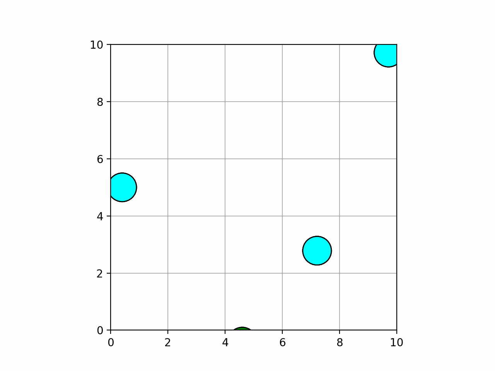
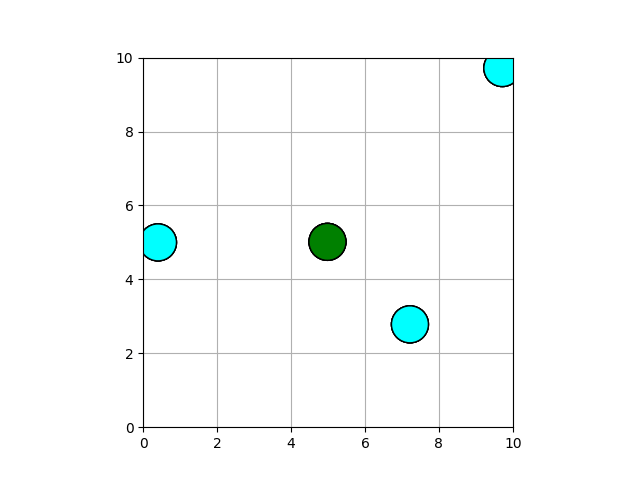
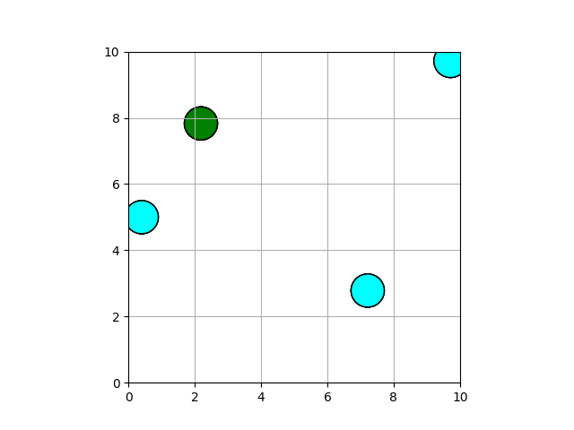
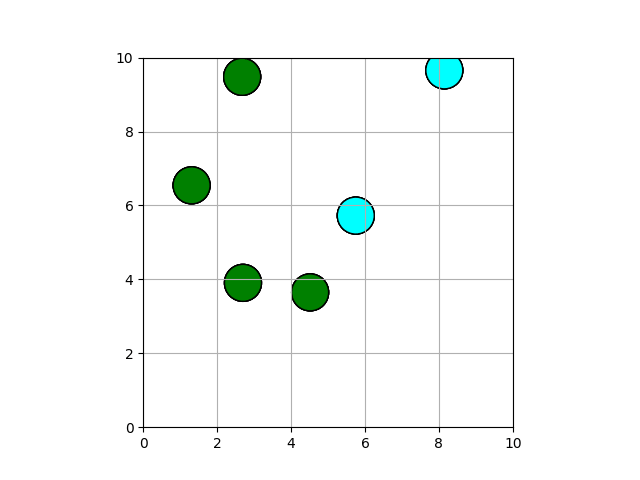

# Multi-Agent path planning in Python

## Dependencies

Install the necessary dependencies by running the following:

```shell
python3 -m pip install -r requirements.txt
brew install ffmpeg
```

## Modified KKT System

#### Execution

Run the following to test the new KKT code:

```bash
cd ./decentralized
python3 decentralized.py -f kkt/new_kkt.mp4 -m kkt
```

#### Results

|          Test (With Optimization)           |
| :-----------------------------------------: |
|  |

## Parallelized Decentralized Code

#### Execution

```bash
python3 ./robotics_project/decentralized/decentralized.py -m nmpc -f output_animation_file_name.gif
```

### Parallelized Total Cost Computation

#### Results

|                   4 Obstacles                    |                   100 Obstacles                    |
| :----------------------------------------------: | :------------------------------------------------: |
|  |  |

### Parallelized Obstacle Prediction

#### Results

|         Test (With Parallel Obstacle Prediction)         |
| :------------------------------------------------------: |
|  |

#### Execution

To run multi-agent NMPC with the parallelized algorithms, run the notebook `decentralized/MultiAgentNMPCParallel.ipynb` in a GPU environment (e.g. Google Colab).

#### Results

|      Multi-Agent Decentralized NMPC w/ Parallelization       |
| :----------------------------------------------------------: |
|  |
