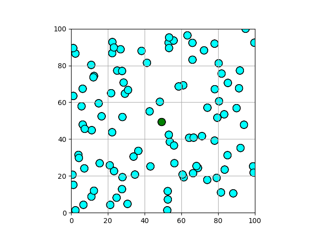

# Multi-Agent path planning in Python

## Dependencies

Install the necessary dependencies by running the following:

```shell
python3 -m pip install -r requirements.txt
brew install ffmpeg
```

## Parallelized Decentralized NMPC
#### Execution
```bash
python3 ./robotics_project/decentralized/decentralized.py -m nmpc -f output_animation_file_name.gif
```

### Parallelized Total Cost Computation
#### Results

|            4 Obstacles            |            100 Obstacles            |
|:--------------------------------------:|:--------------------------------------:|
|  | |

### Parallelized Obstacle Prediction
#### Results
|            Test (With Parallelization)            |
|:--------------------------------------:|
|  | 


## Modified KKT System

#### Execution

Run the following to test the new KKT code:

```bash
cd ./decentralized
python3 decentralized.py -f kkt/new_kkt.mp4 -m kkt
```

#### Results

|            Test (With Optimization)            |
|:--------------------------------------:|
|  | 

## Parallelized Decentralized Code

#### Execution

Run the following to test the new code:

```bash
git checkout taimur/integrate-decentralized-parallel-
cost cd ./decentralized
```

#### Results

|            Test 1 (Success)            |            Test 2 (Failure)            |
|:--------------------------------------:|:--------------------------------------:|
|  | |
